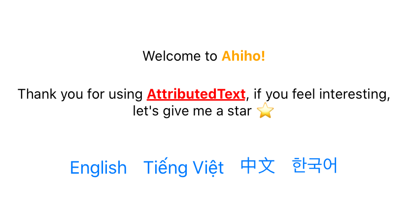

# @ahiho/react-native-attributed-text

It's easy to style the nested text in React Native.



## Installation

```sh
# Yarn
yarn add @ahiho/react-native-attributed-text
# NPM
npm install @ahiho/react-native-attributed-text
```

## Usage

```js
import AttributedText from "@ahiho/react-native-attributed-text";

// ...

<AttributedText
  style={{
    textAlign: 'center',
  }}
  annotationProps={{
    link: {
      style: {
        fontWeight: 'bold',
        color: 'orange',
      },
      onPress: () => {
        console.log('Welcome to Ahiho! Visit https://ahiho.com')
      },
    },
  }}
>
  Welcome to [[link]:[Ahiho!]]
</AttributedText>
```

Let's check the [example](https://github.com/ahiho/react-native-attributed-text/tree/master/example) for more advance used with i18n translation.

## Contributing

See the [contributing guide](CONTRIBUTING.md) to learn how to contribute to the repository and the development workflow.

## License

MIT
